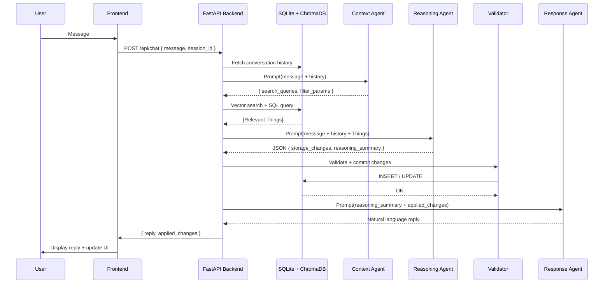

# Reli: System Architecture

## 1. Overview

Reli is a personal AI information manager. It stores knowledge as **Things** (tasks, notes, projects, people, ideas) in a graph structure and processes every user message through a **4-stage multi-agent pipeline** to understand context, reason about changes, and respond naturally.

```
┌─────────────────┐     ┌──────────────────┐     ┌─────────────────┐
│  React SPA      │────▶│  FastAPI Backend  │────▶│  Requesty       │
│  (Vite + TS)    │     │  (Python 3.12)   │     │  (LLM Gateway)  │
└─────────────────┘     └──────────────────┘     └─────────────────┘
                              │    │
                    ┌─────────┘    └─────────┐
                    ▼                        ▼
              ┌──────────┐           ┌──────────────┐
              │  SQLite  │           │  ChromaDB    │
              │  (data)  │           │  (vectors)   │
              └──────────┘           └──────────────┘
```

## 2. The 4-Stage Agent Pipeline

Every chat message flows through four sequential agent stages.

```
User Message
    │
    ▼
┌─────────────────────────────────────┐
│  Stage 1: Context Agent (Librarian) │
│  • Generates search queries         │
│  • Retrieves relevant Things via    │
│    vector search + SQL filters      │
└──────────────────┬──────────────────┘
                   ▼
┌─────────────────────────────────────┐
│  Stage 2: Reasoning Agent (Brain)   │
│  • Analyzes message + context       │
│  • Outputs structured JSON with     │
│    storage changes (create/update)  │
└──────────────────┬──────────────────┘
                   ▼
┌─────────────────────────────────────┐
│  Stage 3: Validator (Code)          │
│  • Validates schema & business      │
│    logic (not an LLM call)          │
│  • Commits changes to SQLite        │
└──────────────────┬──────────────────┘
                   ▼
┌─────────────────────────────────────┐
│  Stage 4: Response Agent (Voice)    │
│  • Generates natural language reply │
│  • Based only on actual changes     │
│    committed — never hallucinates   │
└──────────────────┬──────────────────┘
                   ▼
         Response + UI Updates
```

### Agent Responsibilities

| Stage | Agent | Role | Constraint |
|-------|-------|------|------------|
| 1 | Context Agent | Determines what prior knowledge is relevant | Must not change state |
| 2 | Reasoning Agent | Decides what to create/update/delete | Must output valid JSON, no natural language |
| 3 | Validator | Applies changes to the database | Pure code, no LLM |
| 4 | Response Agent | Explains what happened to the user | Must base reply only on actual applied changes |

**Key files:**
- `backend/pipeline.py` — Orchestrates the 4 stages
- `backend/context_agent.py` — Stage 1
- `backend/reasoning_agent.py` — Stage 2
- `backend/response_agent.py` — Stage 4

### Sequence Diagram



## 3. Memory Architecture

Reli uses three layers of memory to maintain context:

| Layer | Storage | Purpose | Lifetime |
|-------|---------|---------|----------|
| **Long-term** | SQLite Things + ChromaDB vectors | Knowledge graph: tasks, notes, people, projects | Permanent |
| **Short-term** | `conversation_summaries` table | Rolling summary of recent conversation | Rolling window |
| **Working** | Vector search + SQL retrieval | Only what's relevant to the current request | Per-request |

The Context Agent (Stage 1) populates working memory before the Reasoning Agent makes decisions. It generates search queries, runs vector similarity search against ChromaDB, and filters SQLite for structured matches.

## 4. Data Model: Things

Everything in Reli is a **Thing**. Things form a graph connected by typed relationships.

### Core Fields

| Field | Type | Description |
|-------|------|-------------|
| `id` | TEXT (UUID) | Unique identifier |
| `title` | TEXT | Human-readable name |
| `type_hint` | TEXT | Category: `task`, `note`, `project`, `person`, `idea`, etc. |
| `parent_id` | TEXT | Parent Thing ID (for hierarchical nesting) |
| `priority` | INTEGER (1–5) | Urgency level (5 = highest) |
| `checkin_date` | TIMESTAMP | When to surface in briefing |
| `active` | BOOLEAN | False = completed or archived |
| `data` | JSON | Flexible extra fields: `{url, tags, body, ...}` |
| `open_questions` | TEXT | Unresolved questions about this Thing |

### Relationships

Things are connected by typed edges in the `relationships` table:

```
from_thing_id ──[relationship_type]──▶ to_thing_id
```

Example types: `blocks`, `part_of`, `related_to`, `assigned_to`

### SQLite Schema (core tables)

```sql
CREATE TABLE things (
    id TEXT PRIMARY KEY,
    title TEXT NOT NULL,
    type_hint TEXT,
    parent_id TEXT,
    checkin_date TIMESTAMP,
    priority INTEGER DEFAULT 3,
    active BOOLEAN DEFAULT 1,
    data JSON,
    created_at TIMESTAMP DEFAULT CURRENT_TIMESTAMP,
    updated_at TIMESTAMP DEFAULT CURRENT_TIMESTAMP,
    FOREIGN KEY(parent_id) REFERENCES things(id)
);

CREATE TABLE relationships (
    id TEXT PRIMARY KEY,
    from_thing_id TEXT NOT NULL,
    to_thing_id TEXT NOT NULL,
    relationship_type TEXT NOT NULL,
    metadata JSON,
    created_at TIMESTAMP DEFAULT CURRENT_TIMESTAMP
);

CREATE TABLE chat_history (
    id INTEGER PRIMARY KEY AUTOINCREMENT,
    session_id TEXT,
    role TEXT,           -- 'user' or 'assistant'
    content TEXT,
    applied_changes JSON,
    cost_usd REAL,
    model TEXT,
    timestamp TIMESTAMP DEFAULT CURRENT_TIMESTAMP
);
```

## 5. Vector Search (RAG)

Reli uses ChromaDB for semantic search over Things.

- **Vector store:** ChromaDB (persistent, embedded in-process at `backend/chroma_db/`)
- **Embedding model:** `text-embedding-3-small` via Requesty
- **Fallback:** Ollama `nomic-embed-text` (local)

On each Thing create/update, an embedding of the title + type + data is generated and stored in ChromaDB. The Context Agent queries ChromaDB with the user's message to retrieve semantically similar Things, then intersects those results with SQL filters (active status, type_hint, date ranges).

## 6. LLM Routing

All LLM calls route through **Requesty** (`router.requesty.ai/v1`), an OpenAI-compatible gateway.

Model selection is configured in `config.yaml`:

```yaml
llm:
  models:
    context: google/gemini-3.1-flash-lite-preview    # Stage 1: fast, query generation
    reasoning: google/gemini-3-flash-preview         # Stage 2: structured JSON decisions
    response: google/gemini-3.1-flash-lite-preview    # Stage 4: natural language
```

Override per-user via `PUT /api/settings`. Override globally via env vars: `REQUESTY_MODEL`, `REQUESTY_REASONING_MODEL`, `REQUESTY_RESPONSE_MODEL`.

## 7. Authentication

Authentication uses Google OAuth2 with JWT session cookies.

```
Browser ──GET /api/auth/google──▶ FastAPI ──redirect──▶ Google OAuth
                                                              │
Browser ◀──Set-Cookie: reli_session (JWT)─── FastAPI ◀──callback─┘
```

All `/api/*` routes (except `/api/auth/*`) require a valid `reli_session` cookie. The JWT payload contains the user's Google `sub` ID. All database queries apply user-scoped filtering via `user_id`.

## 8. Background Jobs

The sweep scheduler (`sweep_scheduler.py`) runs nightly jobs:

| Job | Purpose |
|-----|---------|
| Preference sweep | Infers user preferences from conversation patterns |
| Connection sweep | Detects semantically related Things to suggest connections |
| Morning briefing | Pre-generates the daily briefing |

Scheduler starts at app startup and stops on shutdown (via FastAPI lifespan context).

## 9. Frontend Architecture

The frontend is a React 19 SPA built with Vite.

| Concern | Approach |
|---------|---------|
| State management | Zustand store (`store.ts`) — Things, chat, UI state |
| API calls | `apiFetch` wrapper (`api.ts`) — handles auth, errors, JSON |
| Validation | Zod schemas (`schemas.ts`) validate API responses |
| Offline | IndexedDB caching + sync engine (`src/offline/`) |
| Routing | No router — panels shown/hidden via store state |

The Vite dev server proxies `/api/*` to `localhost:8000`. In production, the backend serves the built `frontend/dist/` directly via FastAPI's `StaticFiles`.

## 10. Infrastructure

| Component | Details |
|-----------|---------|
| Container | Docker (python:3.12-slim), non-root user `reli:reli` |
| Data persistence | `./data:/app/data` volume — SQLite persists across rebuilds |
| Port | `127.0.0.1:8000` (local only) |
| Public access | Cloudflare Tunnel via `CLOUDFLARE_TUNNEL_TOKEN` |
| CI/CD | GitHub Actions → SSH via Tailscale → `git pull + rebuild` |
| Health check | `GET /healthz` |
