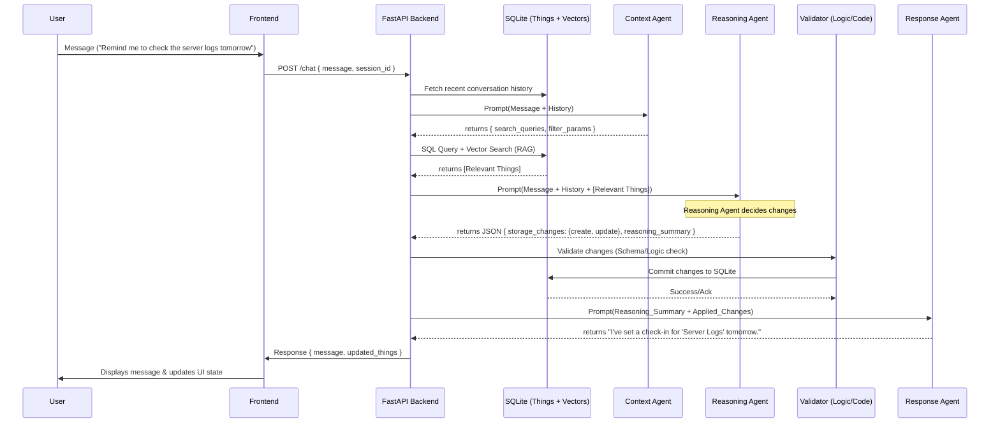

# Reli: System Architecture & Data Flow

## 1. High-Level Data Flow
Reli's primary interface is a conversation. Every message is processed by a sequence of specialized agents to ensure state changes are accurate and reflected correctly in the UI.

### 1.1 Sequence Diagram


## 2. Agent Specifications

### 2.1 Context Agent (The Librarian)
*   **Goal:** Determine what information from the past is needed to answer the current request.
*   **Strategy:** It generates a set of "Search Objectives."
    *   *Example:* "User mentioned 'server logs'. Need to find any Thing with 'server' or 'logs' in the title or notes, and any recent things created in the last 24 hours."

### 2.2 Reasoning Agent (The Brain)
*   **Goal:** Formulate the *intent* of the change.
*   **Constraint:** Must **not** generate natural language for the user. It only outputs valid JSON.
*   **Validation:** If the user's intent is ambiguous, it should populate the `questions_for_user` array instead of making a guess.

### 2.3 Response Agent (The Voice)
*   **Goal:** Explain what just happened in a human-friendly way.
*   **Constraint:** It must base its response **only** on the `reasoning_summary` and the *actual* changes returned from the database. It should never hallucinate a change that didn't happen.

## 3. Storage Layer Details

### 3.1 SQLite Schema (Extended)
```sql
CREATE TABLE things (
    id TEXT PRIMARY KEY,
    title TEXT NOT NULL,
    type_hint TEXT,  -- e.g., 'task', 'note', 'idea'
    parent_id TEXT,
    checkin_date TIMESTAMP,
    priority INTEGER DEFAULT 3,
    active BOOLEAN DEFAULT 1,
    data JSON,  -- Flexible fields: {url: "...", tags: ["..."], body: "..."}
    created_at TIMESTAMP DEFAULT CURRENT_TIMESTAMP,
    updated_at TIMESTAMP DEFAULT CURRENT_TIMESTAMP,
    FOREIGN KEY(parent_id) REFERENCES things(id)
);

CREATE TABLE chat_history (
    id INTEGER PRIMARY KEY AUTOINCREMENT,
    session_id TEXT,
    role TEXT, -- 'user', 'assistant'
    content TEXT,
    applied_changes JSON, -- Snapshot of what changed in this turn
    timestamp TIMESTAMP DEFAULT CURRENT_TIMESTAMP
);
```

## 4. RAG Implementation
*   **Vector Database:** ChromaDB (Running in-process).
*   **Embedding Model:** `text-embedding-3-small` (via OpenAI/OpenRouter) or a local model like `all-MiniLM-L6-v2`.
*   **Strategy:** On every Thing creation or update, the system generates an embedding of the `title` + `type_hint` + `data` body and stores it in ChromaDB.
